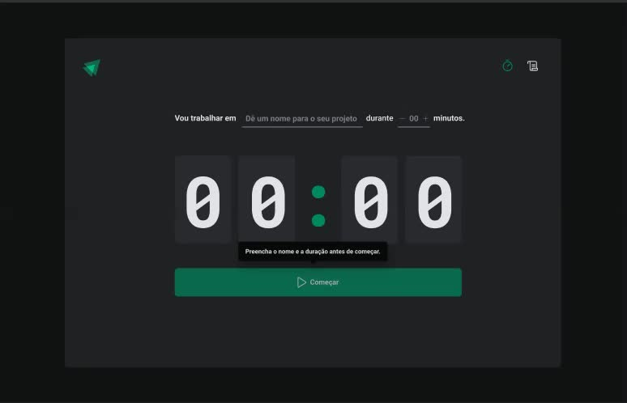

<h1 align="center">
    
    Timer Zone
</h1>

<div align="center">
    
</div>

<div align="center">
  <a href="#-about-the-project">About the project</a>&nbsp;&nbsp;&nbsp;|&nbsp;&nbsp;&nbsp;
  <a href="#-technologies">Technologies</a>&nbsp;&nbsp;&nbsp;|&nbsp;&nbsp;&nbsp;
  <a href="#-getting-started">Getting started</a>&nbsp;&nbsp;&nbsp;|&nbsp;&nbsp;&nbsp;
  <a href="#-how-to-contribute">How to contribute</a>&nbsp;&nbsp;&nbsp;|&nbsp;&nbsp;&nbsp;
  <a href="#-license">License</a>
</div>

<h2 >
	About th project
</h2>

<p>O Timer Zone é um aplicativo criado com React, com a ideia de um app para gerenciamento de tempo. Inspirado no pomodoro, criamos um timer para dedicar o foco em uma tarefa. </p>

## 🚀 Technologies

Technologies that I used to develop this web client

- [React]([https://reactnative.dev](https://reactjs.org))
- [TypeScript](https://www.typescriptlang.org/)
- [React Router Dom](https://reactrouter.com/en/main)
- [useContext](https://reactjs.org/docs/context.html)
- [useReduce](https://reactjs.org/docs/hooks-reference.html#usereducer)
- [immer JS](https://github.com/immerjs/immer)
- [Phosphor](https://phosphoricons.com)

## 💻 Getting started

### Requirements

**Clone the project and access the folder**

```bash
$ git clone https://github.com/ganimedes96/Time-zone && cd Time-zone
```

**Follow the steps below to install the required dependencies**

```bash
# Install the dependencies
$ yarn

# Be sure the file 'src/services/api.ts' have the IP to your API

# Start the client
$ yarn dev
```


**follow the steps below to clone the repository on your machine**

```bash
# Clone your fork
$ git clone your-fork-url && cd Time-zone

# Create a branch with your feature
$ git checkout -b feature

# Make the commit with your changes
$ git commit -m 'First Commit'

# Send the code to your remote branch
$ git push origin my-feature
```
<h2 align="center">
After your pull request is merged, you can delete your branch
	
</h2>

<h3 align='center'>
    Made with 💜 &nbsp;by Hudson Felix 👋 
	
</h3>
